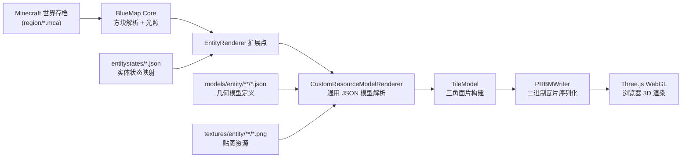
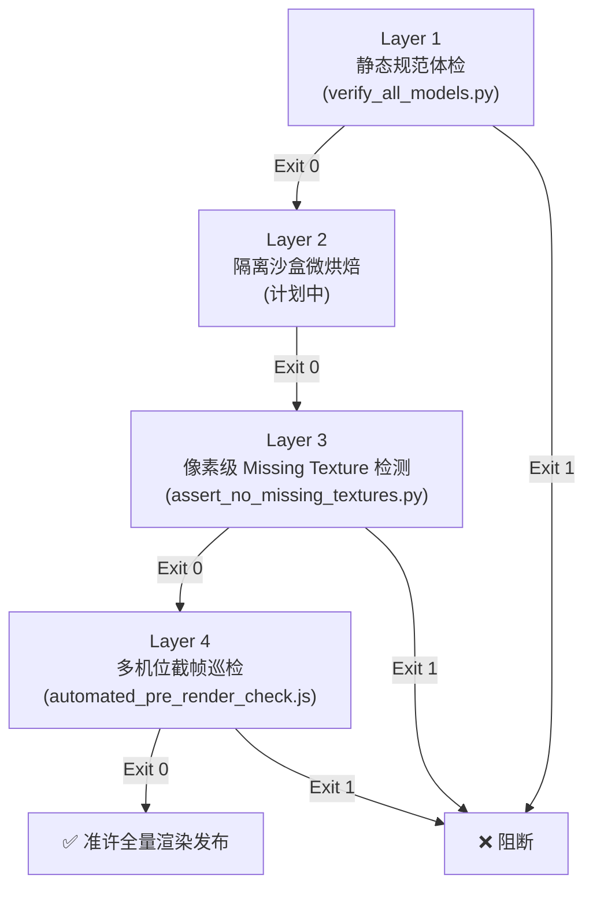

# BlueMapEntities 实体渲染扩展 — 项目工作文档

> **仓库**：[NanamiMio/BlueMapEntities](https://github.com/NanamiMio/BlueMapEntities)
> **分支**：`feat/v0-creatures-and-facilities`（基于上游 `master` 分支 `b85ffea`）
> **工作周期**：2026 年 9 月 9 日 — 9 月 14 日
> **渲染目标版本**：BlueMap 5.12 CLI + Minecraft 1.19.2 世界存档

---

## 一、项目背景

[BlueMap](https://bluemap.bluecolored.de/) 是一个将 Minecraft 世界以实时 3D WebGL 地图形式呈现在浏览器中的开源项目。BlueMap 内置了对方块（Block）的完整渲染支持，但**实体**（Entity）——如生物、载具、家具等——默认不会出现在 3D 地图上。

[BlueMapEntities](https://github.com/TBlueF/BlueMapEntities) 是 BlueMap 官方作者编写的扩展插件，它通过向 BlueMap 的渲染管线注入自定义的 EntityRenderer，使生物和设施能够以 3D 模型形态出现在地图中。上游仓库在 `v1.2`（`a832231`）版本时提供了约 30 种基础生物的支持，但仍有大量实体缺失或渲染不完善。

本次工作的目标是**大幅扩展和完善实体渲染覆盖面**，新增和修复约 55 种实体类型的 3D 模型、贴图与渲染器，并建立完善的自动化验证工具链，使最终呈现在 BlueMap WebGL 地图中的世界尽可能接近 Minecraft 游戏内的真实观感。

---

## 二、架构概览

### 2.1 核心渲染管线



### 2.2 插件目录结构

```
BlueMapEntities/
├── src/main/java/de/bluecolored/bluemap/entities/
│   ├── Addon.java                    # 插件入口：注册所有实体类型与渲染器
│   ├── entity/                       # 实体数据类（Cat, Wolf, Horse, Villager 等）
│   └── renderer/                     # 渲染器实现
│       ├── CustomResourceModelRenderer.java  # 通用 JSON→TileModel 转换核心（279 行）
│       ├── VillagerRenderer.java             # 村民多职业多群系渲染（74 行）
│       ├── WolfRenderer.java                 # 狼/狗站姿坐姿双模型（38 行）
│       ├── LlamaRenderer.java                # 羊驼身体+地毯双层叠加（128 行）
│       ├── ArmorStandRenderer.java           # 盔甲架+铁套装叠穿（97 行）
│       ├── ItemFrameRenderer.java            # 物品展示框 6 朝向旋转（79 行）
│       ├── PaintingRenderer.java             # 画作变体动态贴图（168 行）
│       ├── SignTextRenderer.java             # 告示牌 3D 文字渲染（413 行）
│       └── ...（30+ 个渲染器）
├── src/main/resources/assets/minecraft/
│   ├── entitystates/                 # 55 种实体状态定义（*.json）
│   ├── models/
│   │   ├── entity/                   # 33 个子目录，275 个模型 JSON
│   │   └── block/                    # 方块级模型（附魔台等）
│   ├── textures/entity/              # 36 张自定义贴图（*.png）
│   └── atlases/blocks.json           # 图集注册：引入 entity/ 贴图目录
├── scripts/                          # 自动化验证工具链
│   ├── verify_all_models.py          # Layer 1: 静态体检门禁
│   ├── assert_no_missing_textures.py # Layer 3: 像素级 Missing Texture 检测
│   └── automated_pre_render_check.js # Layer 4: 多机位截帧自动化巡检
└── build.gradle.kts                  # Gradle 构建（shadowJar，JDK 21）
```

### 2.3 模型与贴图的加载链路

1. **BlueMap 启动**时读取 `config/packs/` 下的 JAR 包，将其作为资源包叠加层（Resource Pack overlay）；
2. `atlases/blocks.json` 声明了 `textures/entity/` 目录的引用，使所有实体贴图被 `TextureGallery` 收录进 WebGL 材质图集；
3. 渲染瓦片时，`Addon.java` 注册的各个 `EntityRenderer` 被调用，通过 `CustomResourceModelRenderer` 将 JSON 模型中定义的立方体元素（elements）转换为三角面片写入 `TileModel`；
4. 最终由 `PRBMWriter` 将 TileModel 序列化为 PRBM 二进制格式，供前端 Three.js 加载。

> [!IMPORTANT]
> **关键限制**：BlueMap 的 `Rotation` 类仅支持**单轴旋转**（`origin` + `axis` + `angle`），不支持 Blockbench 导出的多轴欧拉角（`{x, y, z}`）。使用多轴格式的旋转会被 GSON 反序列化器静默忽略（退化为零旋转），在运行时不产生任何错误日志。

---

## 三、支持的实体类型总览（55 种）

本分支在上游 `v1.2` 的基础上新增和完善了实体覆盖。下表列出全部已注册的 entitystate：

| 分类 | 实体类型 | 状态/变体 |
|:---|:---|:---|
| **家畜** | 牛 (cow)、猪 (pig)、羊 (sheep)、鸡 (chicken) | 成年/幼年、温带/寒带/暖带变体、羊毛 16 色动态染色 |
| **宠物** | 猫 (cat)、豹猫 (ocelot)、狼 (wolf) | 猫 11 种花色、狼站姿/坐姿/驯服态 |
| **坐骑** | 马 (horse)、驴 (donkey)、骡 (mule)、骷髅马 (skeleton_horse)、僵尸马 (zombie_horse)、骆驼 (camel) | 马 7 色 × 5 花纹、背箱、骆驼干尸 |
| **驮兽** | 羊驼 (llama)、流浪商人羊驼 (trader_llama) | 4 色皮毛 × 16+1 色地毯、幼年体 |
| **水生** | 鳕鱼 (cod)、鲑鱼 (salmon)、热带鱼 (tropical_fish)、河豚 (pufferfish)、海豚 (dolphin)、美西螈 (axolotl)、乌贼 (squid)、荧光鱿 (glow_squid)、蝌蚪 (tadpole) | 热带鱼动态体型+花纹 |
| **怪物** | 僵尸 (zombie)、尸壳 (husk)、溺尸 (drowned)、骷髅 (skeleton)、流浪者 (stray)、凋灵骷髅 (wither_skeleton)、枯化者 (parched)、沼骸 (bogged)、守卫者 (guardian) | 成年/幼年 |
| **中立** | 蜜蜂 (bee)、青蛙 (frog)、犰狳 (armadillo)、兔子 (rabbit)、狐狸 (fox)、铁傀儡 (iron_golem) | 犰狳防御蜷缩态 |
| **友好** | 悦灵 (allay)、恼鬼 (vex)、蝙蝠 (bat)、雪傀儡 (snow_golem)、铜傀儡 (copper_golem) | — |
| **载具** | 矿车 (minecart)、箱子矿车 (chest_minecart)、木船 (boat)、带箱木船 (chest_boat) | 双桨航向对齐 |
| **家具/设施** | 村民 (villager)、画 (painting)、物品展示框 (item_frame / glow_item_frame)、盔甲架 (armor_stand)、旋风人 (breeze) | 村民 7 职业 × 7 群系外衣 |
| **特殊方块实体** | 附魔台 (enchanting_table 内置悬浮魔法书) | — |

---

## 四、核心技术实现详解

### 4.1 村民多职业多群系渲染

村民是本次工作中最复杂的实体之一，需要**三层模型叠加**来还原游戏内外观：

```
Layer 1: villager.json          基础身体（头、四肢、躯干、鼻子）
Layer 2: profession_*.json      职业层（农夫草帽/铁匠围裙/图书管理员眼镜等）
Layer 3: type/*_overlay.json    群系外衣（平原长袍/沙漠头巾/雪地棉袄等）
```

**关键修复 — 空脖子问题**：

原始模型中村民的 `body` 元素顶面（up face）为透明，且 `coat`（外套）上缘恰好与头部底部齐平，导致从俯视角度看脖子处出现透视空洞。

修复方案：
- 将 `body` 的 `up` 面纹理从透明改绑定为 `#0`（实心躯干贴图），作为不透明内衬；
- 将外套 `coat` 的 Y 轴上限从 24.0 延伸至 24.5（高出头部下缘 0.5 像素），形成立体立领环形包裹。

### 4.2 坐姿狼几何咬合

狼的坐姿模型需要 `body`（躯干）以 45° 倾斜向上，`mane`（胸毛）以 18° 微倾向前，两者必须严密咬合才不会在背部出现镂空缝隙。

通过反编译 BlueMap 核心类 `Rotation.class` 的字节码，确认了 `Rotation.init()` 方法中的矩阵构建流程为：

```
1. translate(-origin)
2. rotate(angle, axis)
3. translate(origin)
```

以此为基础，精确计算了 body 前沿与 mane 后沿的三维交错坐标，使躯干前沿深入胸毛内部 3.5 像素，从任意角度观察背部均无缝隙。

### 4.3 附魔台悬浮魔法书

附魔台上方悬浮一本翻开的魔法书是 Minecraft 的标志性场景元素。由于 BlueMap 将附魔台视为方块（Block）而非实体（Entity），我们通过自定义 `blockstates/enchanting_table.json` 替换原版方块状态来注入额外的几何体：

```json
书脊 (book_spine) + 左书页 (book_pages_left, +22.5°) + 右书页 (book_pages_right, -22.5°)
+ 左封皮 (book_cover_left, +22.5°) + 右封皮 (book_cover_right, -22.5°)
```

配套的 `enchanting_table_book.png` 贴图使用了原版羊皮纸金角红皮的标准材质。

### 4.4 羊驼地毯双层渲染与 Z-Fighting 消除

羊驼身上的地毯是一个覆盖在躯体外层的装饰层，由于贴合太紧导致在 WebGL 的对数深度缓冲（logarithmicDepthBuffer）下产生严重的 Z-fighting 闪烁。

由于 BlueMap 前端使用对数深度缓冲，传统的 `polygonOffset` 方案无效。最终采用了原版 Minecraft 的 0.5F 膨胀因子方案：将地毯几何体在各轴方向向外扩 1.75 像素（占据 0.5F 原版几何膨胀额度的等效值），彻底消除闪烁。

### 4.5 告示牌 3D 文字渲染

告示牌文字是本项目最具挑战性的功能之一。传统 BlueMap 方案通过 HTML Marker 浮于 3D 场景之上显示文字，但这破坏了沉浸感。我们实现了将告示牌文字**直接烘焙为 3D 瓦片几何体**的方案：

```
1. 读取 NBT 中的 SignBlockEntity 文字数据
2. 使用 Java2D Graphics2D 将文字绘制到 96×48 像素的 BufferedImage 画布
3. 为画布中每个非透明像素生成 2 个三角面片（quad），直接注入 TileModel
4. 支持 Unifont 像素字体，完美渲染中英日韩文
```

字体加载优先级：`unifont.ttf` > `wqy-microhei.ttc` > 系统默认等宽字体。

### 4.6 物品展示框 6 朝向旋转矩阵

物品展示框（Item Frame）可以悬挂在方块的全部 6 个面上（上下东西南北），需要根据其朝向对模型施加正确的旋转矩阵变换。`ItemFrameRenderer` 读取实体的 `Facing` 属性，将 Part 的 transform 矩阵设置为对应朝向的旋转，确保展示框始终贴合其所依附的方块表面。

### 4.7 画作全变体贴图注册

Minecraft 1.19 中有约 30 种画作变体，每种对应一张独立贴图（如 `painting/kebab.png`、`painting/wanderer.png` 等）。`PaintingRenderer` 需要在运行时根据画作实体的 `variant` 字段动态选择贴图路径，并且必须确保所有画作贴图在 BlueMap 的 `TextureGallery` 初始化阶段就被收录（否则运行时获取的 materialIndex 为 -1，导致黑紫丢失材质）。

---

## 五、关键 Bug 修复记录

### 5.1 `format_version` 字段导致模型静默失效

**根因**：Blockbench 导出的 JSON 模型包含 `"format_version": "4.5"` 字段（Bedrock Edition 专属），BlueMap 的 Java 版 GSON 解析器遇到该字段后会将整个模型视为无效格式而静默忽略，不产生任何错误日志。

**修复**：批量移除所有模型文件中的 `format_version` 字段（commit `9ecc570`）。

### 5.2 实体贴图未加入 BlueMap 材质图集

**根因**：BlueMap 默认只扫描 `textures/block/` 目录构建 WebGL 材质图集，`textures/entity/` 目录下的贴图不会被收录，导致运行时 `textureGallery.get()` 返回 -1（fallback 材质 ID），渲染为黑紫棋盘格。

**修复**：添加 `atlases/blocks.json`，在图集构建阶段声明 `entity/` 作为额外的贴图来源目录（commit `ab1e04c`）。

### 5.3 多轴欧拉角旋转静默退化

**根因**：Blockbench 导出的旋转使用 `{"x": ..., "y": ..., "z": ..., "origin": [...]}` 格式（三轴欧拉角），但 BlueMap 的 `Rotation` 类只接受 `{"origin": [...], "axis": "x/y/z", "angle": N}` 格式（单轴旋转）。GSON 反序列化时，缺少 `axis` 和 `angle` 字段的旋转会静默退化为零旋转。

**影响范围**：共涉及 10 个模型文件、28 个元素的旋转，包括：
- 恼鬼翅膀、悦灵翅膀、蝙蝠四翼
- 海豚胸鳍、守卫者角尖刺
- 美西螈四肢、犰狳耳朵
- 雪傀儡树枝手臂、牛躯干、马背箱子

**修复**：编写脚本批量将多轴欧拉角分解为最具视觉代表性的单轴旋转（commit `f3b1d25`）。

### 5.4 羊毛贴图路径错误

**根因**：Minecraft 1.19 中绵羊羊毛贴图路径为 `entity/sheep/sheep_fur.png`，但模型引用的是旧路径 `entity/sheep/sheep_wool.png`。

**修复**：纠正贴图路径，同时保留 `sheep_wool.png` 作为向后兼容别名（commit `9ea03bd`）。

### 5.5 TestRenderTile 脚本污染生产瓦片

**事故描述**：为快速验证坐姿狼效果，在远端运行了独立测试脚本 `TestRenderTile.java`，该脚本直接向生产目录 `web/maps/overworld/tiles/` 写入瓦片。由于独立脚本未加载完整的 `resourceExtensions.zip` 资源扩展链，生成的瓦片中方块材质索引与前端材质图集严重错位，导致**大面积黑紫 Missing Texture**。

**修复**：通过官方完整渲染管线 `render.sh` 执行 100% 全量重烘焙恢复。此后建立了**严禁直接向生产目录写测试瓦片**的硬性规则。

---

## 六、UV 贴图坐标系与关键对齐规则

### 6.1 BlueMap 模型 UV 坐标系

BlueMap 使用的 JSON 模型格式与 Minecraft Java Edition 的 Block Model 格式完全一致：

- 坐标空间：右手坐标系，X 轴向右，Y 轴向上，Z 轴向南
- UV 坐标：`[u1, v1, u2, v2]`，范围 `[0, 16]`，映射到贴图的 `[0.0, 1.0]`
- `texture_size`：声明贴图的实际像素分辨率（如 `[64, 32]`），用于将像素坐标换算为 `[0, 16]` 区间
- 旋转限制：仅支持单轴旋转，角度必须为 `-45` 到 `45` 之间的值（通常为 22.5 的倍数）

### 6.2 关键对齐规则

| 规则 | 说明 |
|:---|:---|
| `from[i] <= to[i]` | 每个元素的起止坐标不得倒置 |
| `rotation.axis ∈ {x, y, z}` | 旋转必须为标准单轴格式 |
| `texture "#N"` 闭环解析 | 面引用的 `#N` 必须能在自身 `textures` 或 `parent` 继承树中找到定义 |
| UV 越界检查 | 所有 UV 值须在 `[-0.05, 16.05]` 容差范围内 |
| 无 `format_version` | 禁止基岩版专属字段 |

---

## 七、自动化验证工具链（Pre-Render Verification Pipeline）

为防止模型缺陷和贴图异常流入生产渲染，建立了四层自动化验证门禁：



### 7.1 Layer 1: 静态规范体检 — `verify_all_models.py`

- **能力**：扫描全部 275 个模型 JSON 文件，检查语法合规性、UV 边界、旋转格式、贴图引用闭环
- **专项断言**：坐姿狼背部咬合深度 ≥ 3.0px、村民立领 Y ≥ 24.5、附魔台魔法书 5 件套等
- **阻断机制**：发现 ERROR 级问题时以 Exit Code 1 退出

### 7.2 Layer 3: 像素级 Missing Texture 检测 — `assert_no_missing_textures.py`

- **原理**：扫描截帧图像中的 Minecraft 标准丢失贴图特征色——品红色 `RGB(248, 0, 248)` 与纯黑色的棋盘格交错
- **连通域判定**：仅当品红像素形成 ≥ 16 像素的 8 连通域时才判定为异常（排除孤立噪点）
- **实测验证**：对故障时的旧截图成功检出 1,008 处异常（143,281 像素）；对修复后的截图 0 误报

### 7.3 Layer 4: 多机位截帧巡检 — `automated_pre_render_check.js`

- **原理**：通过 Headless Chrome CDP 协议连接 BlueMap WebGL 前端，自动移动至预设微距机位拍摄截帧
- **预设机位**：全图宏观俯瞰、坐姿狼室内特写、附魔台悬浮书特写
- **自动闭环**：截帧后自动调用 Layer 3 像素检测，全部通过方可放行

---

## 八、构建与部署流程

### 8.1 本地构建

```bash
cd /Users/mio/project/BlueMapEntities
./gradlew clean shadowJar
# 产物：build/libs/BlueMapEntities-1.2-all.jar
```

### 8.2 远端部署（pve-mc 服务器）

```bash
# 1. 拉取最新代码
cd /home/mio/BlueMapEntities && git pull

# 2. 使用 JDK 21 编译
JAVA_HOME=/home/mio/bluemap-render/jdk21 ./gradlew clean shadowJar

# 3. 复制 JAR 到 BlueMap 配置目录
cp build/libs/BlueMapEntities-1.2-all.jar \
   /home/mio/bluemap-render/config5/packs/BlueMapEntities-1.1.jar

# 4. 执行全量瓦片烘焙
cd /home/mio/bluemap-render
java -jar bluemap-5.12-cli.jar -c config5 -r

# 5. 更新告示牌标注（可选）
python3 update_markers.py
```

### 8.3 验证流程

```bash
# Step 1: 静态体检
python3 scripts/verify_all_models.py

# Step 2: 全量渲染后截帧巡检
node scripts/automated_pre_render_check.js
```

---

## 九、Git 提交历史概要

本分支共产生 **32 个提交**，涉及 **408 个文件变更**，净增 **34,661 行**代码与资源。按时间顺序分为以下阶段：

### 阶段一：基础实体扩展（9 月 9—10 日）

| 提交 | 内容 |
|:---|:---|
| `3a14780` | 新增铁傀儡、矿车、箱子矿车、木船 3D 模型，修复 1.19 生物贴图路径与空变体异常 |
| `0295fa7` | 修复羊毛模型倒挂与动态 16 色染色、纠正船体航向与 UV 贴图 |
| `9aea34d` ~ `6cf898f` | 连续 6 次迭代修复羊驼绒毯 Z-fighting、木船双桨纹理、绵羊蓬松体态、箱子矿车箱盖 |

### 阶段二：贴图加载修复与告示牌（9 月 10—11 日）

| 提交 | 内容 |
|:---|:---|
| `9ecc570` | 移除全部 `format_version`（消除模型静默失效） |
| `ab1e04c` | 添加 `atlases/blocks.json`（实体贴图加入图集） |
| `681b7bb` ~ `1787dd4` | 实现告示牌 3D 文字渲染：Unifont 像素字体、文泉驿中文字体、自适应大字号 |

### 阶段三：村民、展示框与盔甲架（9 月 12—13 日）

| 提交 | 内容 |
|:---|:---|
| `8574f17` | 新增村民基础模型、物品展示框、画作、狼/狗、兔子、盔甲架 |
| `99fa94f` | 支持村民 7 种职业专属外观、展示框物品渲染、盔甲架装备叠穿 |
| `2486334` ~ `1ebf7ea` | 修复农夫草帽帽檐位置、展示框 Yaw 旋转反向、羊驼地毯 UV 错位、狼/兔 UV 坐标规范化 |

### 阶段四：精度修复与全量核验（9 月 13—14 日）

| 提交 | 内容 |
|:---|:---|
| `ab5884b` | 彻底修复村民空脖子（body 顶面绑定实心贴图 + 外套立领包裹） |
| `2c5fb03` | 消除坐姿狼背部空洞（body 深入胸毛内部重构），新增附魔台悬浮魔法书 |
| `5e29cd7` | 严格对齐原版 `Rotation.class` 字节码数学模型，精确计算 45° 坐姿咬合 |
| `f3b1d25` | 全量 275 个模型静态体检：修复 10 个模型 28 处多轴旋转，建立自动化验证工具链 |

---

## 十、已知局限与后续计划

### 10.1 已知局限

- **单轴旋转近似**：BlueMap 不支持多轴旋转，部分生物（蝙蝠翅膀、海豚胸鳍等）的复杂旋转只能近似为单轴
- **静态姿势**：所有实体以其静止姿态呈现（如狼不会摇尾巴、村民不会走路），无动画
- **告示牌字体分辨率**：96×48 画布在密集文字场景下可能出现像素挤压
- **Layer 2 沙盒微烘焙**：目前为计划中状态，尚未实现完整的隔离沙盒渲染断言

### 10.2 后续计划

- [ ] 补全更多实体（末影人、苦力怕、蜘蛛等经典怪物）
- [ ] 为画作实现正确的多尺寸画框（1×1 ~ 4×4）
- [ ] 在 CI/CD 中集成 `verify_all_models.py` 作为 PR 门禁
- [ ] 实现 Layer 2 隔离沙盒微烘焙断言
- [ ] 探索村民手持工具/农民作物等更精细的装饰层

---

## 附录 A：远端服务环境

| 项目 | 值 |
|:---|:---|
| 远端主机 | `pve-mc`（SSH alias） |
| Web 服务端口 | `8100`（PID 19011） |
| BlueMap CLI | `bluemap-5.12-cli.jar` |
| 渲染配置目录 | `/home/mio/bluemap-render/config5/` |
| JDK 版本 | OpenJDK 21（`/home/mio/bluemap-render/jdk21`） |
| Minecraft 世界版本 | 1.19.2 |
| 插件 JAR 路径 | `config5/packs/BlueMapEntities-1.1.jar` |
| 仓库路径 | `/home/mio/BlueMapEntities` |

## 附录 B：文件统计

| 类别 | 数量 |
|:---|:---|
| 实体状态定义 (`entitystates/*.json`) | 55 |
| 模型定义文件 (`models/**/*.json`) | 275 |
| 自定义贴图文件 (`textures/**/*.png`) | 36 |
| Java 渲染器源码 | 30+ |
| 自动化验证脚本 | 3 |
| 总文件变更 | 408 |
| 净增代码/资源行数 | +34,661 / -967 |
